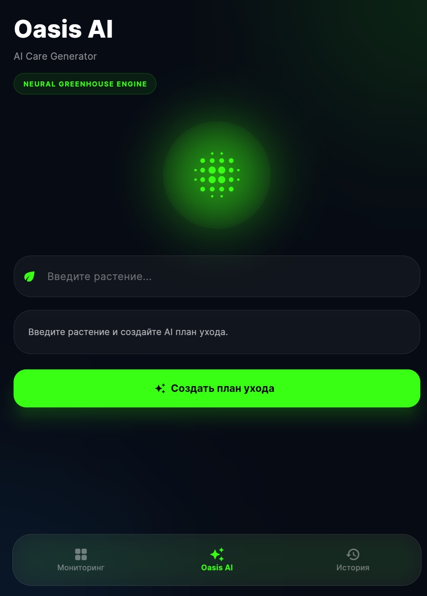
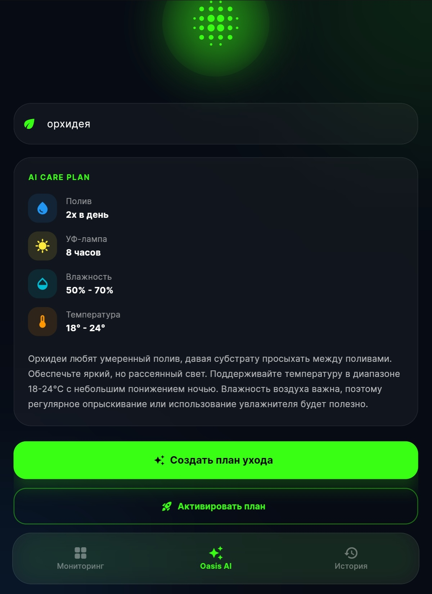
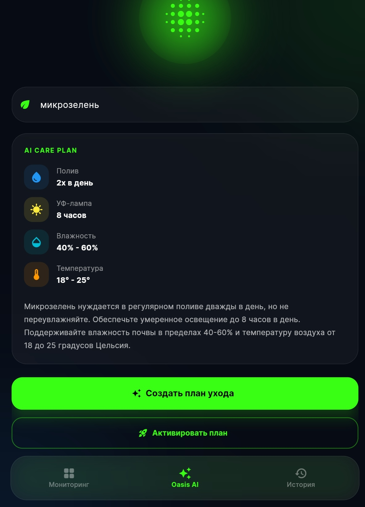
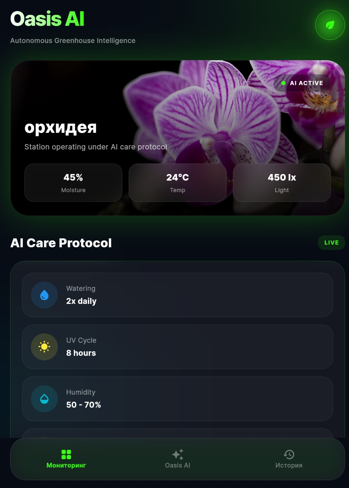
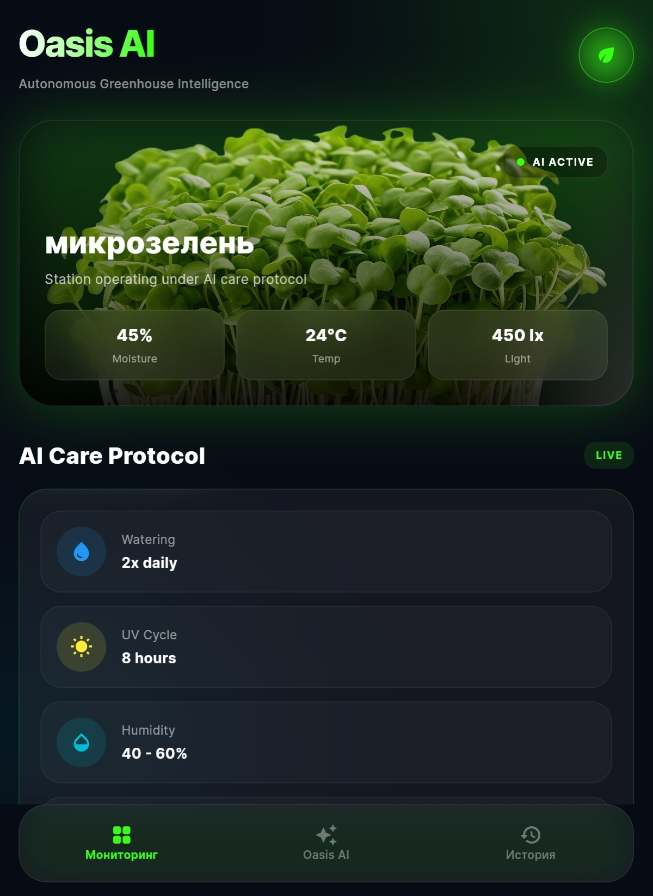
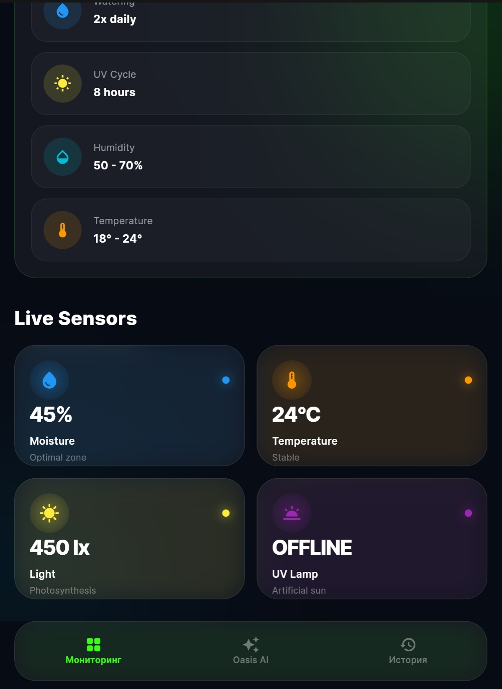
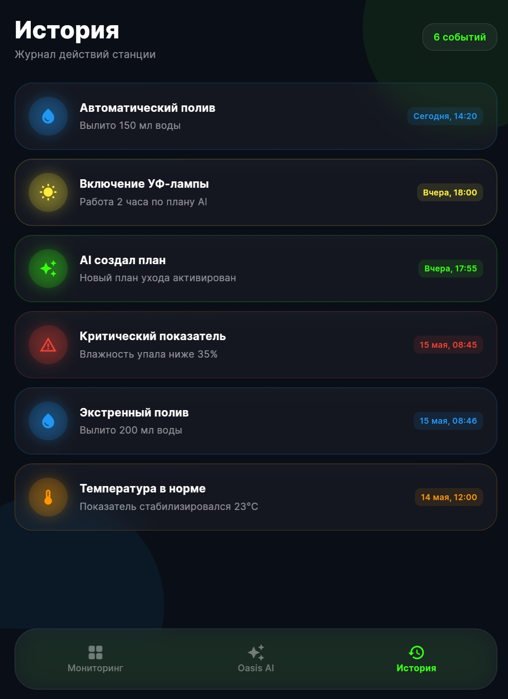

# 🌱 Oasis AI — Autonomous Greenhouse Intelligence

  <a href="#русский">Русский</a> • 
  <a href="#english">English</a>

---

## Русский

**Oasis AI** — умная система автоматического ухода за растениями на базе IoT и искусственного интеллекта. Проект представляет собой комплекс из смарт-теплицы и кроссплатформенного приложения.

Интеллектуальная система автоматизированного ухода за растениями работает на базе микроконтроллера ESP32, мобильного приложения на Flutter и интеграции с искусственным интеллектом через OpenRouter API.

### Архитектура системы
[ Датчики: влажность, темп., свет ]
│
▼
[ Интерфейс платы ESP32 ] <─── (Реле / Помпа / Линии питания)
│
▼
Firebase Realtime DB 🧠
│
▼
[ Flutter App ] ──> OpenRouter API (ИИ) ──> Персональный план ухода
### Что уже в планах и разработке

* 📊 **Мониторинг:** Получение данных о влажности почвы, температуре воздуха и освещённости с датчиков ESP32 в реальном времени.
* 🤖 **ИИ-аналитика:** Интеграция с нейросетью через OpenRouter API для генерации индивидуальных планов ухода под каждый вид растения.
* 💧 **Автополив:** Автоматическая подача воды помпой при падении уровня влажности ниже критического.
* 💡 **Умный свет:** ИИ-управление УФ-лампой для продления светового дня растений.
* 📋 **История событий:** Логирование ключевых показателей теплицы и действий системы в базу данных Firebase.

---

## 📱 Интерфейс приложения

### Основной экран и генерация планов ухода
Приложение позволяет автоматически создавать индивидуальные протоколы заботы для любого типа растений (например, для орхидей или микрозелени) с помощью нейросети.

  
  
  

### Активный мониторинг и датчики
Экран отслеживания в реальном времени собирает данные с сенсоров (влажность, температура, освещенность) и управляет состоянием периферии (УФ-лампы, автополив).

  
  
  

### История событий
Журнал логирует все действия станции: автоматические сессии полива, включение освещения по таймеру AI и критические уведомления об отклонении показателей от нормы.

  

---

## 🛠 Технологический стек / Tech Stack

### Подробный состав компонентов
* **Hardware:** ESP32, датчики влажности почвы, датчик освещенности (BH1750), датчик температуры и влажности воздуха (DHT22), реле управления помпой и УФ-лампой.
* **Mobile & Web:** Flutter, Dart, Firebase (Firestore, Realtime Database, Authentication, Hosting).
* **AI Integration:** OpenRouter API для кастомного анализа состояния экосистемы.

### Спецификация слоев

| Слой | Технологии |
| :--- | :--- |
| **Мобильное приложение** | Flutter, Dart |
| **Микроконтроллер** | ESP32 |
| **База данных / Облако** | Firebase Realtime Database, Cloud Services, Hosting |
| **Интеграция с ИИ** | OpenRouter API (LLM модели) |

---

## English

**Oasis AI** is an intelligent, automated smart greenhouse system powered by IoT hardware and Artificial Intelligence. The project seamlessly combines a hardware monitoring station with a cross-platform mobile application to deliver precision agriculture for indoor plants.

The ecosystem utilizes an ESP32 microcontroller to gather environmental metrics, routes them through Firebase cloud services, and leverages advanced LLMs via OpenRouter API to build tailor-made cultivation strategies.

### System Architecture

[ Sensors: Moisture, Temp, Light ]
│
▼
[ ESP32 Microcontroller ] <─── (Relays / Water Pump / UV Lights)
│
▼
Firebase Realtime DB 🧠
│
▼
[ Flutter App ] ──> OpenRouter API (LLM) ──> Customized Care Plan

### Core Features & Roadmap

* 📊 **Real-Time Dashboard:** Streaming live soil moisture, ambient temperature, and light levels directly from the greenhouse sensors.
* 🤖 **AI-Driven Agronomy:** Integrating with LLMs via OpenRouter API to generate specialized, species-specific growth and care plans.
* 💧 **Automated Irrigation:** Smart threshold management that triggers the water pump when moisture drops below unsafe levels.
* 💡 **Intelligent Lighting:** Automated UV lamp cycles designed by AI to optimize and extend the daylight duration for specific crops.
* 📋 **Station Event Logging:** Saving comprehensive history tracking, data trends, and automatic actions into Firebase Realtime Database.

### Hardware & Software Technical Breakdown

* **Hardware Layer:** ESP32 board, capacitive soil moisture sensors, BH1750 ambient light sensors, DHT22/DHT11 temperature and humidity sensors, and multi-channel relay modules for driving pumps and UV grow lamps.
* **Mobile & Frontend:** Flutter framework and Dart language providing responsive, beautiful, dark-themed Android, iOS, and Web layouts.
* **Cloud Infrastructure:** Firebase Realtime Database for instant state synchronization, Firebase Authentication for user security, and Firebase Hosting for web deployments.
* **AI Engine:** OpenRouter API abstraction layer for processing plant conditions and translating text recommendations into structured hardware parameters.
